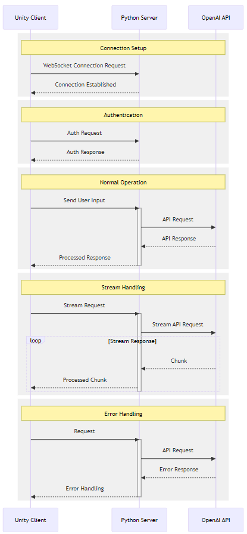

 
## Key Technologies and Concepts

### 1. Communication Protocols

- **WebSocket Protocol**
  - Real-time bidirectional communication
  - Persistent connections
  - Lower latency than HTTP
  - Perfect for real-time VR applications

- **TCP/IP Protocol**
  - Alternative to WebSocket
  - Lower level implementation
  - Custom message formatting
  - Connection management

### 2. Server Technologies

- **Python Frameworks**
  - FastAPI: Modern, fast framework for building APIs
  - WebSocket support through `websockets` library
  - `uvicorn` as ASGI server
  - AsyncIO for asynchronous operations

- **Message Queue Systems**
  - Redis for message caching
  - RabbitMQ for complex message routing
  - Helps handle high traffic scenarios

### 3. Data Serialization
- **JSON**
  - Standard data format
  - Easy to parse in both Unity and Python
  - Human-readable format

- **Protocol Buffers**
  - Binary serialization
  - More efficient than JSON
  - Strict typing
  - Better performance for large data

### 4. Unity Integration

- **WebSocket Client**
  - NativeWebSocket package
  - WebSocketSharp library
  - Custom implementation using System.Net.WebSockets

- **Threading**
  - Understanding Unity's main thread
  - Async operations in Unity
  - Message queuing system

### 5. OpenAI Integration
- **API Authentication**
  - API key management
  - Rate limiting
  - Error handling

- **Response Processing**
  - Stream handling
  - Token management
  - Response parsing

### 6. System Architecture Concepts

- **Event-Driven Architecture**

  - Message passing
  - Event queues
  - Pub/sub patterns

- **State Management**

  - Session handling
  - Conversation context
  - Error states

## System Architecture Diagram
 

 